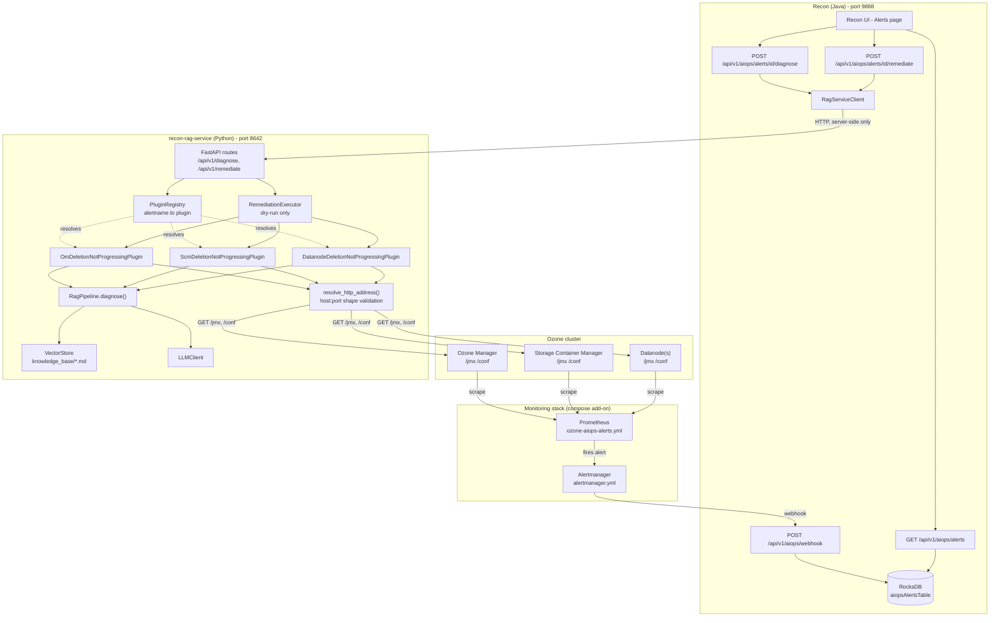
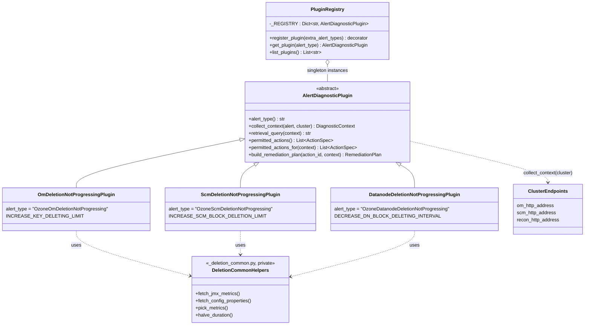
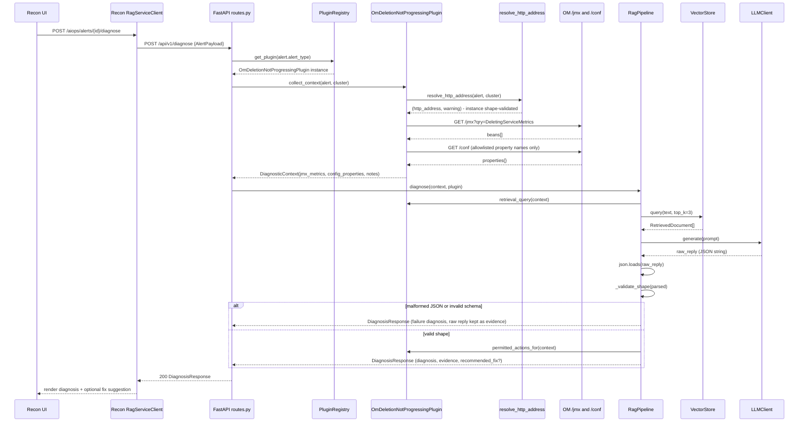
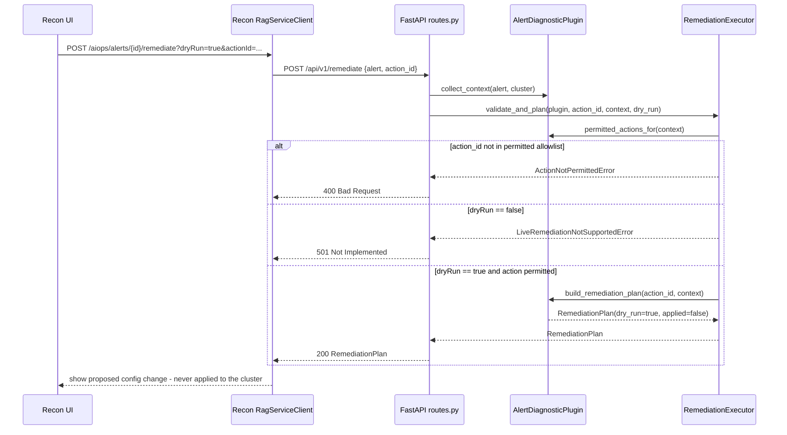
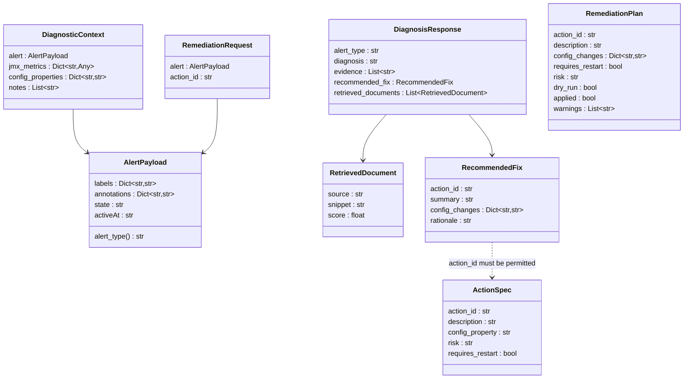
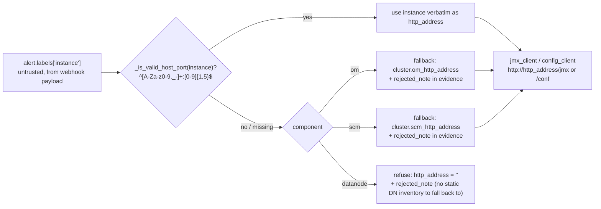
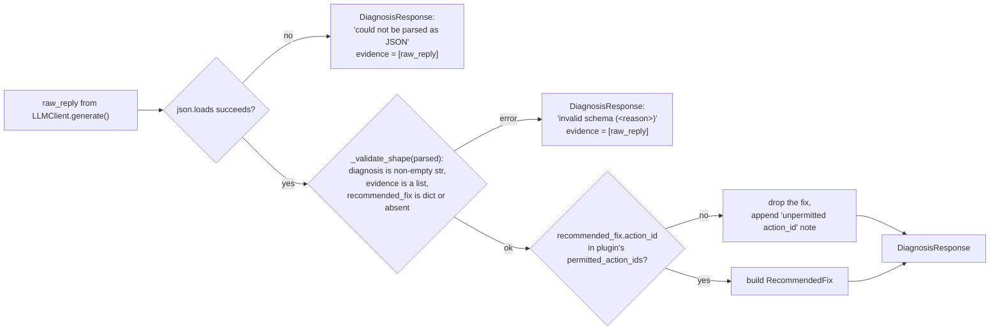

<!---
 Licensed to the Apache Software Foundation (ASF) under one or more
 contributor license agreements.  See the NOTICE file distributed with
 this work for additional information regarding copyright ownership.
 The ASF licenses this file to you under the Apache License, Version 2.0
 (the "License"); you may not use this file except in compliance with
 the License.  You may obtain a copy of the License at

     http://www.apache.org/licenses/LICENSE-2.0

 Unless required by applicable law or agreed to in writing, software
 distributed under the License is distributed on an "AS IS" BASIS,
 WITHOUT WARRANTIES OR CONDITIONS OF ANY KIND, either express or implied.
 See the License for the specific language governing permissions and
 limitations under the License.
-->

# Design: Pluggable deletion-not-progressing diagnosis (OM / SCM / Datanode)

**Component:** `recon-rag-service` (standalone FastAPI microservice) +
Recon's AIOps gateway (Java) + Prometheus/Alertmanager (compose add-ons)

**Status:** Implemented on branch `OzoneAutoHeal`. Prototype/POC, not an ASF
contribution — no Jira ID or OEP is associated with it.

## 1. Problem statement

Ozone's deletion pipeline has three independent hops that can each get stuck
without the other two being affected:

1. **OM `KeyDeletingService`** — scans the deleted-key table and hands work
   to SCM.
2. **SCM `SCMBlockDeletingService`** — drains the `DeletedBlockLog` backlog
   by sending block-deletion commands to datanodes.
3. **Datanode `BlockDeletingService`** — executes the deletion commands
   locally against container data.

`ozone-aiops-alerts.yml` already fires one Prometheus alert per hop
(`OzoneOmDeletionNotProgressing`, `OzoneScmDeletionNotProgressing`,
`OzoneDatanodeDeletionNotProgressing`), each with severity tiers derived from
how long the stall has held (5m/30m/1h/24h → low/medium/high/critical).

This document describes how `recon-rag-service` turns one of those firing
alerts into an evidence-backed diagnosis and a dry-run remediation plan, and
the design decisions behind the current (post-refactor) plugin architecture.

## 2. Goals / non-goals

**Goals**

- One self-registering plugin per Prometheus `alertname` — adding a fourth
  deletion-style alert must never require editing a shared dispatcher.
- Diagnosis must be grounded in metrics actually read from the cluster
  (JMX + config), not fabricated by the LLM layer.
- Remediation is plan-only: nothing in this service ever mutates cluster
  state.
- Untrusted input (the alert payload) must not be able to steer outbound
  requests, and untrusted output (the LLM reply) must not be trusted without
  a shape check.

**Non-goals**

- Live remediation execution (`dryRun=false`) — deferred, tracked in the
  README roadmap.
- A production-grade vector database or hosted LLM — both are swappable via
  env vars but default to dependency-free, deterministic implementations.
- Cross-hop root-cause correlation (e.g. "OM is stuck *because* SCM is
  stuck") — each plugin diagnoses its own hop only, in this iteration.

## 3. End-to-end architecture

Key property: **the browser never talks to `recon-rag-service` directly** in
the compose deployment. Recon is the only caller, and it forwards
Prometheus-shaped `AlertPayload` JSON verbatim to `/api/v1/diagnose` and
`/api/v1/remediate`.

## 4. Plugin SPI (the pluggability contract)

`app/plugins/base.py` defines the one abstraction every alert-specific
handler implements. The rule, stated in both `base.py` and
`app/plugins/__init__.py`, is: **one plugin == one Prometheus alertname**.
New alert types are added by dropping in a new module and decorating its
class with `@register_plugin` — never by editing a central `if/elif`.

This is the Python analogue of the `ServiceLoader`/SPI pattern already used
elsewhere in Ozone (e.g. `OmTransportFactory.createFactory`): a single
well-known extension point (`alert_type -> plugin`) that plugin modules
attach themselves to at import time via a decorator, rather than a
dispatcher that has to know about every alert type.

### 4.1 Module layout (after the split)

| Module | Alertname | Own constants |
|---|---|---|
| `app/plugins/om_deletion_not_progressing.py` | `OzoneOmDeletionNotProgressing` | `OM_DELETING_SERVICE_JMX_QUERY`, `OM_JMX_KEYS`, `OM_CONFIG_PROPERTIES`, `INCREASE_KEY_DELETING_LIMIT` |
| `app/plugins/scm_deletion_not_progressing.py` | `OzoneScmDeletionNotProgressing` | `SCM_BLOCK_DELETING_JMX_QUERY`, `SCM_JMX_KEYS`, `SCM_CONFIG_PROPERTIES`, `INCREASE_SCM_BLOCK_DELETION_LIMIT` |
| `app/plugins/datanode_deletion_not_progressing.py` | `OzoneDatanodeDeletionNotProgressing` | `DN_BLOCK_DELETING_JMX_QUERY`, `DN_JMX_KEYS`, `DN_CONFIG_PROPERTIES`, `DECREASE_DN_BLOCK_DELETING_INTERVAL` |
| `app/plugins/_deletion_common.py` | *(not a plugin — private helpers)* | `fetch_jmx_metrics`, `fetch_config_properties`, `pick_metrics`, `halve_duration` |

Each plugin owns exactly one `ActionSpec` and rejects every other
`action_id` in `build_remediation_plan`. There is no cross-plugin
`_COMPONENT_ACTIONS`-style dispatch table left anywhere in the package.

### 4.2 Adding a fourth plugin (e.g. a hypothetical snapshot-deletion alert)

1. Add the alert rule to `ozone-aiops-alerts.yml` with its own `alertname`.
2. Create `app/plugins/<new_alert>.py` implementing `AlertDiagnosticPlugin`,
   reusing `_deletion_common.py` helpers if the collection shape matches
   (JMX bean + allowlisted config properties).
3. Decorate the class with `@register_plugin()`.
4. Add one import line to `app/plugins/__init__.py`.
5. Add a `tests/test_plugin_<new_alert>.py` mirroring the existing three.

No other file changes — `pipeline.py`, `routes.py`, and the executor are
alert-agnostic by construction.

## 5. Request flow: `POST /api/v1/diagnose`

## 6. Request flow: `POST /api/v1/remediate` (dry-run only)

`RemediationPlan.dry_run` is always `True` and `.applied` is always `False`
in this build; no code path in the executor or any plugin issues a mutating
call against OM/SCM/DN.

## 7. Data model

All models are `pydantic.BaseModel`s (`app/models.py`), so every boundary
(plugin → pipeline → executor → HTTP response) is schema-validated by
FastAPI/pydantic automatically — with one deliberate exception (§8.2),
which is why an explicit shape check had to be added by hand.

## 8. Safety-hardening added in this iteration

### 8.1 SSRF-shaped `instance` label (`app/collectors/endpoints.py`)

`AlertPayload.labels["instance"]` originates from a Prometheus/Alertmanager
payload and is ultimately interpolated into an outbound request:
`jmx_client.fetch_beans` / `config_client.fetch_properties` both build
`f"http://{http_address}/jmx"` / `f"http://{http_address}/conf"`. Without
validation, a crafted or misconfigured `instance` label (a scheme,
credentials, a path, or an arbitrary host) could steer that request —
a classic SSRF-shaped-input pattern.

This is **shape validation, not a known-host allowlist**: OM/SCM HA means
there's no single static "the" address to compare against, and
`ClusterEndpoints` has no static datanode inventory either. It still closes
the concrete vulnerability — nothing today lets `instance` become
`evil.example.com`, `169.254.169.254:80`, or `host:9874/../secrets` and have
it dereferenced.

### 8.2 LLM reply schema validation (`app/rag/pipeline.py`)

`RagPipeline.diagnose()` previously checked only that the LLM's reply
parsed as JSON (`json.loads`), not that it matched the shape the prompt
asked for. A reply that is syntactically valid JSON but the wrong shape
(`evidence` as a string instead of a list, a missing `diagnosis`, a
non-object `recommended_fix`) would have been trusted as-is.

This mirrors the anti-hallucination posture the rest of the pipeline already
follows (never trust a payload without checking it) and is symmetric with
the existing JSON-parse-failure path: both failure modes return the raw
reply as evidence for troubleshooting rather than surfacing malformed data
further up the stack.

### 8.3 Unchanged safety properties

- **Action allowlisting**: `permitted_actions()`/`permitted_actions_for()`
  are the only source of truth for what a plugin may ever propose; an LLM
  suggesting an unrecognized `action_id` gets it silently dropped (§8.2),
  and `RemediationExecutor` independently re-validates the same allowlist
  before building a plan.
- **Dry-run-only remediation**: `RemediationPlan.dry_run` is always `True`
  and `.applied` is always `False`. `dryRun=false` short-circuits to
  `LiveRemediationNotSupportedError` → HTTP 501 before any plugin method
  that could describe a mutation is even reached.
- **`/conf` allowlisting**: `config_client.fetch_properties` only ever
  requests the specific property names a plugin lists (`OM_CONFIG_PROPERTIES`
  etc.), never the full effective configuration, since `/conf` can echo
  back secrets configured in `ozone-site.xml`.

## 9. Testing strategy

| Layer | File | Covers |
|---|---|---|
| OM plugin | `tests/test_plugin_om_deletion_not_progressing.py` | `collect_context` happy path, missing bean, unreachable JMX; `permitted_actions[_for]`; `build_remediation_plan` (doubling, wrong-action rejection) |
| SCM plugin | `tests/test_plugin_scm_deletion_not_progressing.py` | same shape, plus the `/conf` XML-fallback path |
| Datanode plugin | `tests/test_plugin_datanode_deletion_not_progressing.py` | same shape, plus interval-halving |
| Endpoint resolution | `tests/test_collectors_endpoints.py` | malformed `instance` (`http://…`, `user@host:…`, path traversal, non-host:port) rejected and falls back/refuses per component, exactly as a missing label does |
| RAG pipeline | `tests/test_pipeline.py` | valid diagnosis + permitted fix; unpermitted `action_id` dropped; malformed JSON; **valid-JSON-but-wrong-shape** (`evidence` not a list, missing `diagnosis`, non-object `recommended_fix`) |
| HTTP surface | `tests/test_api.py` | end-to-end through FastAPI's `TestClient`: health, plugin listing, 404 for unknown alert, diagnose, remediate (200/400/501) |

Each plugin's test module mocks only its own component's `/jmx` and `/conf`
via `respx`, so the three plugins' tests can never accidentally pass because
of another plugin's fixture — a direct consequence of the one-module-per-
alertname split.

## 10. Deferred / out of scope

Carried over from the README roadmap, unaffected by this change:

- Live remediation execution (`dryRun=false`) against a real cluster, gated
  behind explicit operator opt-in and an audit trail.
- A production vector database / curated knowledge base beyond the two
  illustrative runbook documents in `knowledge_base/`.
- Cross-hop correlation (e.g. inferring that OM's stall is downstream of a
  stuck SCM hop) — each plugin currently diagnoses its own hop in isolation.
